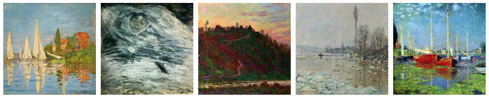
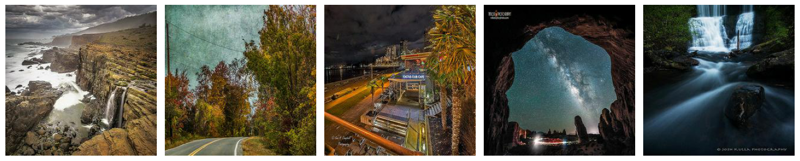
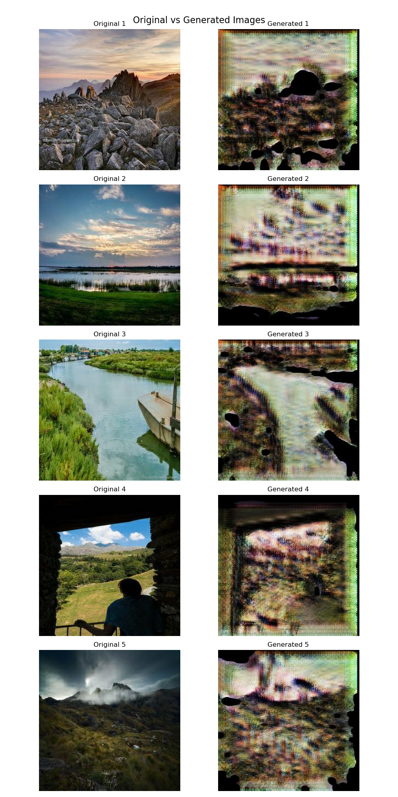

# GANs-something-of-a-painter-myself

## 1. Description
The goal of this project is to use Generative Adversarial Networks (GANs), specifically a CycleGAN, to transform ordinary photos into images that mimic the style of Claude Monet's paintings. The CycleGAN will learn to translate images from the domain of photographs to the domain of Monet paintings without needing paired examples of photos and paintings.

Monet Paintings Dataset:
- Number of images: 300
- Unique dimensions: [[256 256]]
- Color modes: {'RGB'}

Photos Dataset:
- Number of images: 7038
- Unique dimensions: [[256 256]]
- Color modes: {'RGB'}

## 2. EDA
Monet Paintings:

Photos:

## 3. Model Architecture
#### Comparison
##### 1. standard GAN
In a standard GAN, there are two main components:
- Generator (G): This model generates new data instances (e.g., images) that resemble the training data. Its goal is to create data that the discriminator cannot distinguish from real data.
- Discriminator (D): This model evaluates the data produced by the generator against real data. Its goal is to correctly classify data as either "real" (from the training set) or "fake" (generated by G).
##### 2. CycleGAN
- Two Generators:
  - Generator G: Transforms images from domain X (e.g., photos) to domain Y (e.g., Monet-style paintings).
  - Generator F: Transforms images from domain Y (Monet-style paintings) back to domain X (photos).
- Two Discriminators:
  - Discriminator D_X: Tries to distinguish between real images from domain X and fake images generated by F.
  - Discriminator D_Y: Tries to distinguish between real images from domain Y and fake images generated by G.
- Cycle Consistency Loss:
  - To ensure that the transformation is meaningful, CycleGAN introduces the concept of cycle consistency. This means if you transform an image to the other domain and back again, you should get the original image. 
- Identity Loss (Optional but often used):This loss ensures that if you input an image from one domain into the generator corresponding to that domain, it should produce the same image. 
#### Summary
The code I've been working on implements a CycleGAN, which is a specific type of GAN designed for unpaired image-to-image translation. Unlike a standard GAN, which might generate new images from random noise, a CycleGAN is focused on transforming images from one domain to another (e.g., turning photos into Monet-style paintings).

## 4. Results and Analysis
### 1. Hyperparameter Tuning
### 2. Initial training
### 3. Fine-tuning
### 4. Generate images

## 5. Conclusion
### 1. Strengths:
- Comprehensive approach: The project covers all major steps from data preparation to model evaluation.
- Hyperparameter tuning: Uses Bayesian optimization for finding optimal hyperparameters.
- Data augmentation: Implements various image augmentation techniques to improve model generalization.
- Evaluation metrics: Includes MiFID (Modified Inception Frechet Distance) for quantitative evaluation.
### 2. Areas for Improvement:
- Model complexity: The current generator and discriminator architectures are relatively simple. Consider implementing more advanced architectures like ResNet-based models.
- Training stability: GANs can be unstable during training. Consider implementing techniques like gradient penalty or spectral normalization to improve stability.
- Evaluation: While MiFID is implemented, it's not used in the training loop. Consider integrating it into the training process for model selection.
